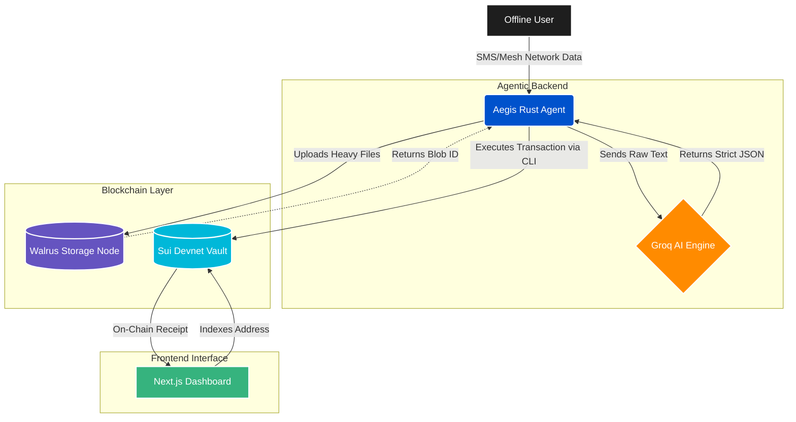

# Aegis: The Offline-to-Online Data Bridge
Built for the Sui Hackathon (Agentic Web & Walrus Tracks)

##  The Problem
In low-bandwidth and offline environments, interacting with Web3 infrastructure or backing up massive datasets to decentralized storage networks like Walrus is physically impossible. 

## The Solution
Aegis is an autonomous Rust agent and Web3 command center. It catches unstructured offline data (via SMS, Bluetooth, or local mesh), uses an embedded Groq AI to parse the intent, and autonomously bridges that data to the Walrus network the moment it catches a sliver of internet connectivity. It then logs an immutable receipt onto the Sui Devnet.

##  Architecture
Our monorepo consists of three distinct pillars:
1. **Aegis Vault (Sui Move):** The smart contracts living on the Sui Devnet.
2. **Rust Agent:** The local backend that interfaces with Groq AI to parse natural language and uses the local Sui CLI to securely sign and execute Programmable Transaction Blocks.
3. **Command Center (Next.js):** A real-time indexer using `@mysten/sui.js` to read the blockchain and verify that offline payloads have been successfully committed.

##  How to Run Locally

### 1. Boot the Agent
Ensure you have the Sui CLI installed and configured to `devnet`.
```bash
cd rust-agent
export GROQ_API_KEY="your_api_key_here"
cargo run

Step 2: Create a massive Ignore File

node_modules/
target/
.env
.next/

Step 3: Commit and Push

Bash
git add .
git commit -m "Initial commit: Aegis Architecture with Rust, Sui, and Walrus integration

git branch -M main
git remote add origin https://github.com/YOUR_USERNAME/aegis-bridge.git
git push -u origin main


